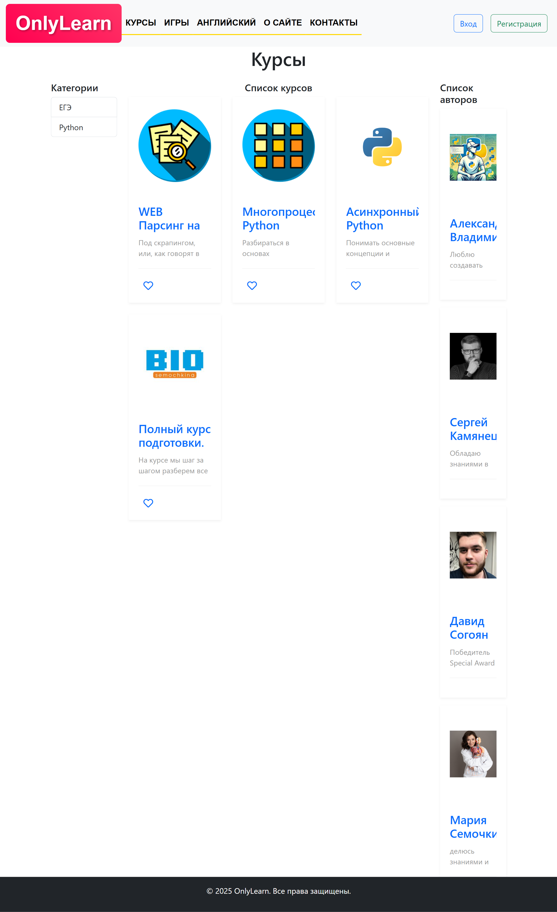

# OnlyLearn
Сайт курсов, для обучения.
## Как использовать:
1. Скачать этот репозиторий или клонировать его
2. Перейти в папку репозитория при помощи cd
3. pip install -r requirements.txt
4. python manage.py runserver --insecure

## Версии ПО
Django 5.2, рекомендуется использовать python 3.10 и выше. В данном случае использовался 3.10.
## Как использовать
1. Что бы добавить курс необходимо добавить категорию делается это по адресу.
/courses/addcategory/ так же добавить автора, по адресу. /courses/addauthors/
2. После добавления автора, и категорий, можно добавлять курс. Выполняется по адресу
/courses/addcourses/ где выбирается категория, автор, и данные для курса.
3. Возможно добавлять отзывы. делается по адресу /addreviews/
4. Возможно добавлять мотивационный текст в банер, по адресу /addbanner/
## URL
1. [localhost]/addbanner/
2. [localhost]/addreviews/
3. [localhost]/courses/addcategory/
4. [localhost]/courses/addauthors/
5. [localhost]/courses/addcourses/
# Скриншоты интерфейса

